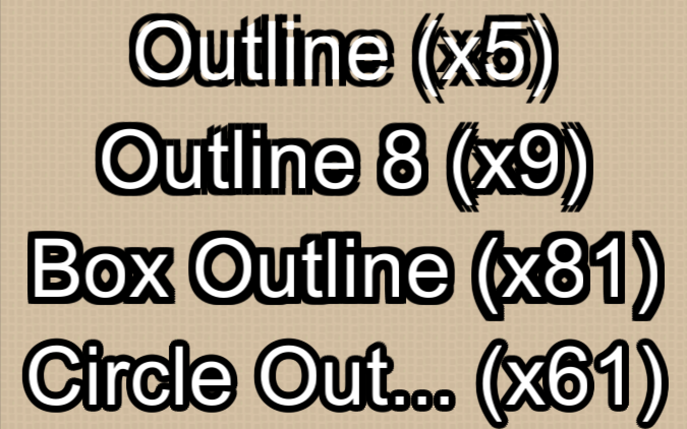
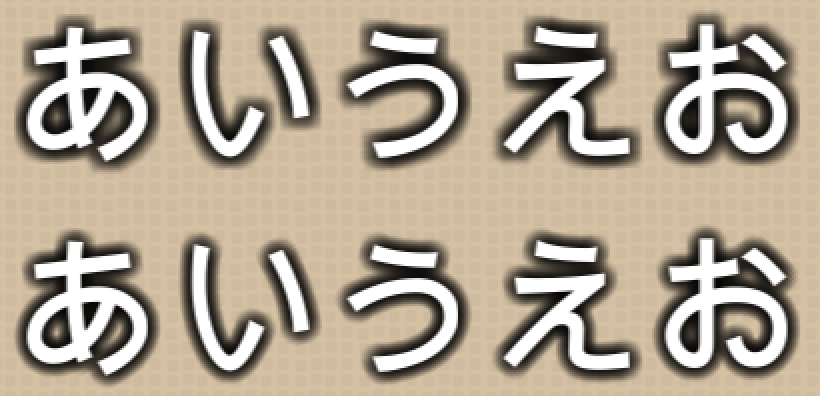

# Beautiful Text Outline for Unity UI
### Unity UIのTextに綺麗な輪郭線を付ける

This repository contains improved versions of the [Outline](http://docs.unity3d.com/Manual/script-Outline.html) effect. They can render **thick** text outline beautifully. They can be also used as soft (blurred) shadow effects.

## Keywords
Unity uGUI Text Outline Shadow 文字 縁取り 輪郭 影 

## Comparison
__CAUTION__: Parenthesized numbers are rendering costs relative to text without outline.
Take care where to use!

### Outline
The builtin outline effect. It cannot render thick outlines correctly.
It renders colored text meshes at **4 slightly shfted positions (up-left, up-right, down-left and down-right)** from the main text mesh.
### Outline8
A slightly improved version of **Outline**.
It renders text meshes at **8 positions (up, down, left, right, up-left, up-right, and so on)**.
It is equivalent to *BoxOutline* of (X,Y)=(1,1).
### BoxOutline
Generalized version of **Outline8**.
It renders text meshes at **(2X+1)*(2Y+1)-1 positions on a grid** whose center is same as the main text mesh.
### CircleOutline
This can express **outline thickness** correctly.
It renders text meshes at **(N+K)+(N+2K)+... positions**.
Each **N+iK** positions are on a circle whose radius is **i** and center is same as the main text mesh.

## Drop shadow
When the alpha of the outline color is small, the outlines look like soft shadow:

## Performance
Not good, as you can imagine. I recommend the following assets and techniques.
* [Text Mesh Pro](https://www.assetstore.unity3d.com/jp/#!/content/17662)
* [Improved Alpha-Tested Magnification for Vector Textures](http://www.valvesoftware.com/publications/2007/SIGGRAPH2007_AlphaTestedMagnification.pdf)
* [Resolution Independent Curve Rendering using Programmable Graphics Hardware](http://research.microsoft.com/en-us/um/people/cloop/LoopBlinn05.pdf)

## Unity versions
The APIs for modifying UI meshes are different among versions:
* 5.5-5.1: *IVertexModifier.ModifyVertices(List<UIVertex>)*
* 5.2-5.2.1: *IMeshModifier.ModifyMesh(Mesh)*
* 5.2.1p1-: *IMeshModifier.ModifyMesh(VertexHelper)*

In this project, *ModifiedShadow* absorbs these differences.
When you use our scripts in Unity 5.2.1pX, please define **UNITY_5_2_1pX** at *Scripting Define Symbols* in *Player Settings*.
